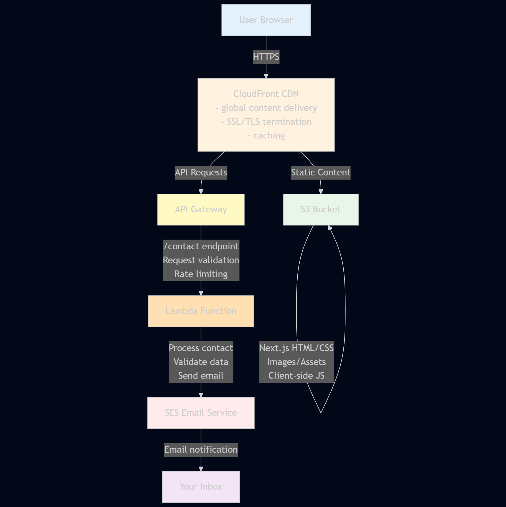

# Architecture: Service Website MVP

## Skills Breakdown

- DevOps:
  - Serverless architecture (No server management and auto-scaling)
  - Infrastructure as code (Stretch goal to use AWS CDK)
  - Separation of concerns (Static content (S3 Bucket) vs dynamic API (Contact Form))
  - Cost Optimized (Pay only for what you use)
- Machine Learning (ML):
  - API gateway pattern to expose ML models
  - Lambda for model inference endpoints
  - Scalable to allow adding a recommendation engine

## Minimum Viable Product (MVP)

- Pages:
  - Homepage (Hero section, services overview, and social proof)
  - Services (Detailed description of services)
  - About (Expertise and why to choose service provider)
  - Contact (Form with email integration)
- Features:
  - Responsive mobile-first design
  - Contact form that emails owner
  - Fast loading
  - SEO optimized
  - SSL certificate (HTTPS)
- Stretch MVP:
  - ML recommendation engine
  - User accounts/authentication
  - Payment processing
  - Booking system
  - Blog/CMS
